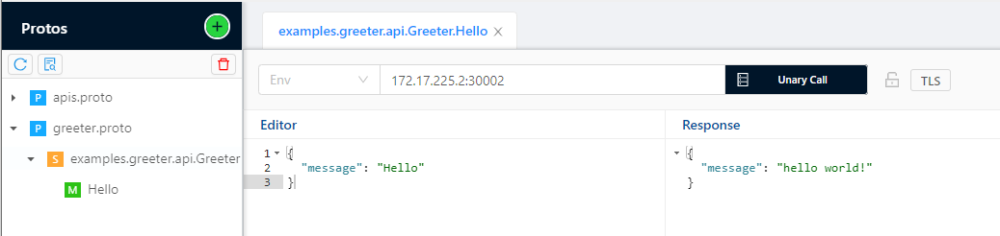

# PowerMock

PowerMock是一个Mock Server的实现，它同时支持HTTP与gRPC协议接口的Mock，并提供了灵活的插件功能。
这个工具面向于前后端、测试等对有接口Mock需求的开发人员，也可以作为一个通用的Mock服务，部署在网关架构或API管理平台中，实现降级、接口Mock等功能。

## 功能

作为一个Mock Server，PowerMock具有以下的核心功能：
1. 支持 **HTTP协议** 与 **gRPC协议** 接口的Mock。
2. 支持配置 **Javascript** 等脚本语言来动态生成响应。
3. 支持对一个接口配置多种响应，并**按照条件**进行区分。
4. 匹配条件支持**多种运算符**(AND/OR/>/</=等)。
4. 支持返回静态数据以及 **特定领域的随机数据**。
5. 支持 **插件** 功能，可以通过编写插件实现其他匹配或Mock引擎。
6. 同时提供HTTP与gRPC接口，可以动态对MockAPI进行 **增删改查** 。
7. 开箱即用的Redis存储，并支持**自由拓展其他存储引擎**，比如MySQL、etcd。
8. 同时支持 windows / darwin / linux 的 32 位 与 64 位。
9. 语言无关，任何使用HTTP协议或gRPC协议的项目均可以使用本工具。

## 安装

## 示例

### 较为高级的用法

以下面这份配置为示例：

```yaml
uniqueKey: "1"
path: "/examples.greeter.api.Greeter/Hello"
method: "POST"
cases:
  - condition:
      simple:
        items:
          - operandX: "$request.header.uid"
            operator: "<="
            operandY: "1000"
    response:
      simple:
        header:
          x-unit-id: "3"
          x-unit-region: "sh"
        trailer:
          x-api-version: "1.3.2"
        body: |
          {"timestamp": "1111", "message": "This message will only be returned when uid <= 1000", "amount": "{{ $mock.price }}"}
  - condition:
      simple:
        items:
          - operandX: "$request.header.uid"
            operator: ">"
            operandY: "1000"
    response:
      script:
        lang: "javascript"
        content: |
          (function(){
              function random(min, max){
                  return parseInt(Math.random()*(max-min+1)+min,10);
              }
              return {
                  code: 0,
                  header: {
                      "x-unit-id": (request.header["uid"] % 5).toString(),
                      "x-unit-region": "bj",
                  },
                  trailer: {
                      "x-api-version": "1.3.2",
                  },
                  body: {
                      timestamp: Math.ceil(new Date().getTime() / 1000),
                      message: "this message is generated by javascript, your uid is: " + request.header["uid"],
                      amount: random(0, 5000),
                  },
              }
          })()
```

这份配置定义了一个`MockAPI`，用于匹配所有路径为 `/examples.greeter.api.Greeter/Hello`，方法为 `POST` 的请求，它包含了两个场景，能够实现这样的效果：

#### [场景一]
当请求 Header 中的 `uid <= 1000` 时：
* Response Header 中写入:
```
x-unit-id: "3"
x-unit-region: "sh"
```
* Response Trailer 中写入:
```
x-api-version: "1.3.2"
```
* Response Body 中写入:
```
{"timestamp": "1111", "message": "This message will only be returned when uid <= 1000", "amount": "{{ $mock.price }}"}
```
其中的 `{{ $mock.price }}` 是魔法变量，用于返回一个随机的价格数据。最终，客户端收到的 `Response Body` 类似于：
```
{
	"timestamp": "1111",
	"message": "This message will only be returned when uid <= 1000",
	"amount": 7308.4
}
```

#### [场景二]
当请求 Header 中的 `uid > 1000` 时，通过执行以下Javascript脚本返回响应：
```
(function(){
    function random(min, max){
        return parseInt(Math.random()*(max-min+1)+min,10);
    }
    return {
        code: 0,
        header: {
            "x-unit-id": (request.header["uid"] % 5).toString(),
            "x-unit-region": "bj",
        },
        trailer: {
            "x-api-version": "1.3.2",
        },
        body: {
            timestamp: Math.ceil(new Date().getTime() / 1000),
            message: "this message is generated by javascript, your uid is: " + request.header["uid"],
            amount: random(0, 5000),
        },
    }
})()
```
在这个脚本中，根据请求的 Header，以及一些内置或自定义函数来生成了响应的code、header、trailer与body。
最终客户端收到的响应体类似于：
```
{
	"timestamp": 1622093545,
	"message": "this message is generated by javascript, your uid is: 2233",
	"amount": 314
}
```

它描述了一个相对复杂的场景，当然可能你的需求比较简单，实战的话，我们先从Hello World开始吧！


### 从Hello World开始吧

首先，创建一个配置文件：
```
log:
    pretty: true
    level: debug
grpcmockserver:
    enable: true
    address: 0.0.0.0:30002
    protomanager:
        protoimportpaths: [ ]
        protodir: ./apis
httpmockserver:
    enable: true
    address: 0.0.0.0:30003
apimanager:
    grpcaddress: 0.0.0.0:30000
    httpaddress: 0.0.0.0:30001
pluginregistry: { }
plugin:
    simple: { }
    grpc: { }
    http: { }
    script: { }
    redis:
        enable: false
        addr: 127.0.0.1:6379
        password: ""
        db: 0
        prefix: /powermock/
```

将编译好的PowerMock与上面创建好的配置文件放到同一个目录中，像下面这样：
```
➜ ls -alh
total 45M
drwxrwxrwx 1 storyicon storyicon 4.0K May 27 14:18 .
drwxrwxrwx 1 storyicon storyicon 4.0K May 24 11:43 ..
-rwxrwxrwx 1 storyicon storyicon  546 May 27 14:16 config.yaml
-rwxrwxrwx 1 storyicon storyicon  45M May 27 14:18 powermock
```

然后执行
```
➜ ./powermock serve --config.file config.yaml
```
如果没有端口冲突的话，你应该已经可以看到服务运行起来了!

#### HTTP接口

在上面的目录下，创建一个名为 apis.yaml 的文件:
```yaml
uniqueKey: "hello_example_http"
path: "/hello"
method: "GET"
cases:
    - response:
          simple:
              header:
                  x-unit-id: "3"
                  x-unit-region: "sh"
              trailer:
                  x-api-version: "1.3.2"
              body: |
                  hello world!
```

然后运行：
```
➜ ./powermock load --address=127.0.0.1:30000 --file apis.yaml
2:32PM INF start to load file component=main file=load.go:59
2:32PM INF mock apis loaded from file component=main count=1 file=load.go:64
2:32PM INF start to save api component=main file=load.go:76 host= method=GET path=/hello uniqueKey=hello
2:32PM INF succeed! component=main file=load.go:89
```

这样，我们描述的MockAPI就创建起来了。

通过 `curl` 或者你的浏览器请求 `http://127.0.0.1:30003/hello`，可以看到返回给我们 hello world 了！
```
➜ curl http://127.0.0.1:30003/hello -i
HTTP/1.1 200 OK
Content-Type: application/json
X-Unit-Id: 3
X-Unit-Region: sh
Date: Thu, 27 May 2021 06:36:28 GMT
Content-Length: 12

hello world!

```

#### gRPC接口

在上面的目录中，创建一个 apis 目录，使整个目录结构像下面这样：
```
➜  ls -alh
total 45M
drwxrwxrwx 1 storyicon storyicon 4.0K May 27 14:42 .
drwxrwxrwx 1 storyicon storyicon 4.0K May 27 14:37 ..
drwxrwxrwx 1 storyicon storyicon 4.0K May 27 14:23 apis
-rwxrwxrwx 1 storyicon storyicon 1.8K May 27 14:32 apis.yaml
-rwxrwxrwx 1 storyicon storyicon  546 May 27 14:16 config.yaml
-rwxrwxrwx 1 storyicon storyicon  45M May 27 14:18 powermock
```

在 apis 目录中创建我们的 greeter.proto：

```
syntax = "proto3";

package examples.greeter.api;
option go_package = "github.com/storyicon/powermock/examples/helloWorld/apis;apis";

service Greeter {
    rpc Hello(HelloRequest) returns (HelloResponse);
}

message HelloRequest {
    string message = 2;
}

message HelloResponse {
    string message = 2;
}
```

现在整个目录结构像这样：
```
.
├── apis
│   └── greeter.proto
├── apis.yaml
├── config.yaml
└── powermock
```

重新运行我们的 `powermock` 来加载我们新写的proto文件：
```
➜ ./powermock serve --config.file config.yaml
2:55PM INF starting load proto from: ./apis component=main.gRPCMockServer.protoManager file=service.go:102
2:55PM INF api loaded component=main.gRPCMockServer.protoManager file=service.go:131 name=/examples.greeter.api.Greeter/Hello
```
在启动日志中可以看到我们新创建的 proto 文件已经被加载到 PowerMock 中了。

将我们的 apis.yaml 文件修改成下面的内容：
```
uniqueKey: "hello_example_http"
path: "/hello"
method: "GET"
cases:
    - response:
          simple:
              header:
                  x-unit-id: "3"
                  x-unit-region: "sh"
              trailer:
                  x-api-version: "1.3.2"
              body: |
                  hello world!

---

uniqueKey: "hello_example_gRPC"
path: "/examples.greeter.api.Greeter/Hello"
method: "POST"
cases:
    - response:
          simple:
              header:
                  x-unit-id: "3"
                  x-unit-region: "sh"
              trailer:
                  x-api-version: "1.3.2"
              body: |
                  {"message": "hello world!"}
```
可以看到，里面添加了一个名为 "hello_example_gRPC" 的 MockAPI，我们通过下面的命令装载它：
```
➜ powermock load --file apis.yaml  --address=127.0.0.1:30000
3:06PM INF start to load file component=main file=load.go:59
3:06PM INF mock apis loaded from file component=main count=2 file=load.go:64
3:06PM INF start to save api component=main file=load.go:76 host= method=GET path=/hello uniqueKey=hello_example_http
3:06PM INF start to save api component=main file=load.go:76 host= method=POST path=/examples.greeter.api.Greeter/Hello uniqueKey=hello_example_gRPC
3:06PM INF succeed! component=main file=load.go:89
```
这样，我们的MockAPI就被添加到PowerMock中了。

如果你的环境中有BloomRPC之类的工具的话，可以先通过BloomRPC加载 greeter.proto，然后调用 `127.0.0.1:30002`：



如果使用编程语言进行调用的话，以 golang 为例，通过下面的代码调用 `PowerMock`:
```go
func main() {
	fmt.Println("starting call mock server")
	conn, err := grpc.Dial("127.0.0.1:30002", grpc.WithInsecure())
	if err != nil {
		panic(err)
	}
	client := apis.NewGreeterClient(conn)

	var header, trailer metadata.MD
	startTime := time.Now()
	resp, err := client.Hello(context.TODO(), &apis.HelloRequest{
		Message: "hi",
	}, grpc.Header(&header), grpc.Trailer(&trailer))
	if err != nil {
		panic(err)
	}
	fmt.Printf("[elapsed] %d ms \r\n", time.Since(startTime).Milliseconds())
	fmt.Printf("[headers] %+v \r\n", header)
	fmt.Printf("[trailer] %+v \r\n", trailer)
	fmt.Printf("[response] %+v \r\n", resp.String())
}
```
日志输出是这样的：
```
starting call mock server
[elapsed] 2 ms
[headers] map[content-type:[application/grpc] x-unit-id:[3] x-unit-region:[sh]]
[trailer] map[x-api-version:[1.3.2]]
[response] message:"This message will only be returned when uid <= 1000"
```

可以看到，我们的接口被成功Mock出来了！
